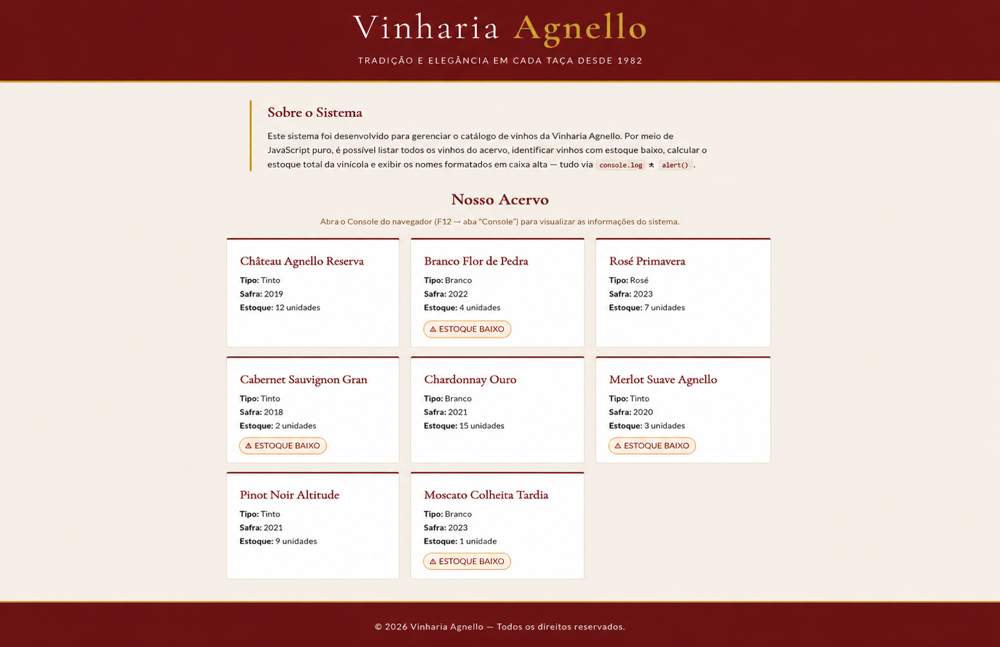

# 🍷 Vinharia Agnello — Sistema de Gerenciamento de Vinhos
<!-- Dessenvolvido por: João Pedro De Souza -->
## 📌 Descrição do Projeto

O projeto **Vinharia Agnello** foi desenvolvido com o objetivo de simular um sistema de gerenciamento de catálogo de vinhos utilizando **HTML5, CSS3 e JavaScript puro**.

A aplicação apresenta um catálogo visual moderno e elegante, permitindo visualizar os vinhos disponíveis da vinícola, além de executar funcionalidades de manipulação de dados diretamente no navegador utilizando métodos nativos do JavaScript.

O sistema também exibe relatórios automáticos no **Console do navegador** e utiliza `alert()` para apresentar informações importantes ao usuário.

---

# ✅ Funcionalidades Implementadas no Checkpoint 03

## 🍇 Catálogo de Vinhos
O sistema possui um array de objetos que funciona como um pequeno banco de dados contendo:

- Nome do vinho
- Tipo
- Safra
- Quantidade em estoque

---

## 📋 Listagem Completa dos Vinhos
Utilizando o método `forEach()`, o sistema percorre todos os vinhos cadastrados e exibe suas informações completas no console.

### Exemplo:
```js
vinhos.forEach(function (vinho) {
  console.log(vinho.nome);
});
```

---

## ⚠️ Identificação de Estoque Baixo
Com o método `filter()`, o sistema identifica automaticamente os vinhos com menos de 5 unidades em estoque.

Esses vinhos:
- São exibidos no console
- Recebem um badge visual nos cards
- Geram um alerta automático ao iniciar o sistema

### Exemplo:
```js
const estoqueBaixo = vinhos.filter(function (vinho) {
  return vinho.estoque < 5;
});
```

---

## 📦 Cálculo do Estoque Total
Através do método `reduce()`, o sistema calcula a soma total de todas as unidades de vinhos disponíveis na vinícola.

### Exemplo:
```js
const total = vinhos.reduce(function (acumulador, vinho) {
  return acumulador + vinho.estoque;
}, 0);
```

---

## 🔠 Conversão dos Nomes para Caixa Alta
Com o método `map()`, todos os nomes dos vinhos são transformados para letras maiúsculas e exibidos no console e nos alertas.

### Exemplo:
```js
const nomesMaiusculos = vinhos.map(function (vinho) {
  return vinho.nome.toUpperCase();
});
```

---

## 🖼️ Renderização Dinâmica de Cards
Os cards dos vinhos são criados dinamicamente via JavaScript utilizando `innerHTML`.

Cada card exibe:
- Nome
- Tipo
- Safra
- Estoque
- Badge de estoque baixo (quando necessário)

---

## 🎨 Interface Responsiva e Elegante
O projeto foi estilizado utilizando CSS moderno com:

- Variáveis CSS (`:root`)
- CSS Grid Layout
- Hover Effects
- Responsividade
- Google Fonts
- Paleta de cores inspirada em vinhos

---

# 🛠️ Tecnologias Utilizadas

- HTML5
- CSS3
- JavaScript ES6
- Google Fonts

---

# 📂 Estrutura do Projeto

```bash
📁 vinharia-agnello
 ┣ 📂 src
 ┃ ┣ 📂 css
 ┃ ┃ ┗ 📄 style.css
 ┃ ┗ 📂 js
 ┃   ┗ 📄 script.js
 ┣ 📄 index.html
 ┗ 📄 README.md
```

---

# ▶️ Como Executar o Projeto

1. Faça o download ou clone o repositório
2. Abra o arquivo `index.html` no navegador
3. Pressione `F12`
4. Abra a aba **Console**
5. Visualize os relatórios gerados pelo sistema

---

# 💡 Conceitos Aplicados

Durante o desenvolvimento foram aplicados conceitos como:

- Arrays de objetos
- Manipulação de DOM
- Métodos de arrays
- Estruturas condicionais
- Template literals
- Eventos JavaScript
- Responsividade
- Organização de código
- Interface visual moderna

---

# 👨‍💻 Integrante

**João Pedro De Souza**

---

# 🔗 GitHub Pages

```
https://joao-jps.github.io/vinheria-agnello-checkpoint03/
```

---

# 📸 Demonstração do Projeto

```md

```

---

# 📄 Considerações Finais

O projeto foi desenvolvido com foco em praticar conceitos fundamentais de JavaScript e manipulação de dados, além de construir uma interface visual agradável e organizada.

A aplicação demonstra como integrar lógica de programação com renderização visual no navegador utilizando apenas tecnologias front-end puras.